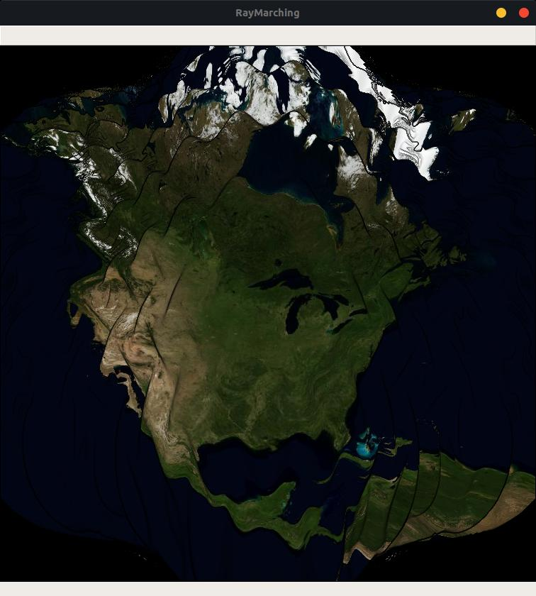

A little raymarching prototype I worked on one day. Runs at >30fps on my 1070Ti.

I'd like to try to try and use elevation maps to offset the SDF when ray marching. There is no efficient way to do it without error, but I think that taking the ray points at each iteration and sampling the elevation map at the closest point on the WGS84 ellipsoid and using it as the offset for the next iteration would work well enough.
Also, I'd like to add level-of-detail texturing.

#### Images
 - Distorted ellipsoid to show shading

 - Running with low (4) iterations gets an interesting stereographic projection-looking effect

